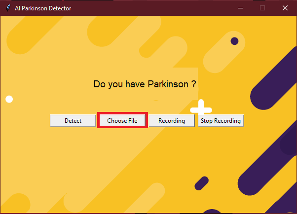
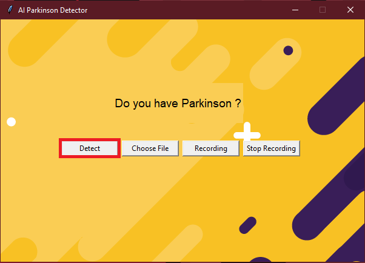
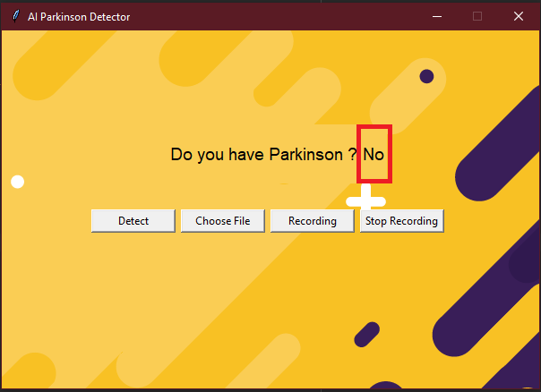

# Let's start

Watch the presentation video here :https://www.youtube.com/watch?v=K1oLz4x87Ug&feature=youtu.be

Take a look at our Medium article : https://medium.com/@alan.marthineau/diagnosing-parkinsons-disease-by-voice-using-linear-regression-in-python-73aad2712fba?sk=cb817fbc1479dbfde6095c98accd9c20

GitHub of the Parkinson detect lib : https://github.com/alan91620/ParkinsonRecoLib


## Getting Started
- Clone the repo and cd into the directory
```sh
git clone git@github.com:Milkad0/ParkinsonIA.git
cd ParkinsonIA
```
- Install jolib, pandas, numpy, sklearn, and praat-parselmouth
```sh
pip install joblib
pip install pandas
pip install numpy
pip install sklearn
pip install praat-parselmouth
```

- Install pyaudio

Try to install with pip :
```sh
pip install pyaudio
```
If it does not work, install with one of the file in the "package" directory

Python 3.8.* :

32bits
```sh
pip install PyAudio-0.2.11-cp38-cp38-win32.whl
```
64bits
```sh
pip install PyAudio-0.2.11-cp38-cp38-win_amd64.whl
```

Python 3.7.* :

32bits
```sh
pip install PyAudio-0.2.11-cp37-cp37m-win32.whl
```
64bits
```sh
pip install PyAudio-0.2.11-cp37-cp37m-win_amd64.whl
```

If you have the following error "filename.whl is not supported wheel on this platform", try to use 32bits file instead of 64bits file (and vice versa)
- Run the app
```sh
python main.py
```
## How it works?

### Choose a file 

- Click on the "Choose File" button



- Select a .wav audio file


- Click on the "Detect" button



- Watch the result !


### Record your voice

- Click on the "Recording" button


- Turn on your microphone and read the displayed text


- Click on the "Stop Recording" button


- Click on the "Detect" button


- Watch the result !



## Collaborators

Alan MARTHINEAU - Vincent ETHEVE - Augustin LOLLIVIER
