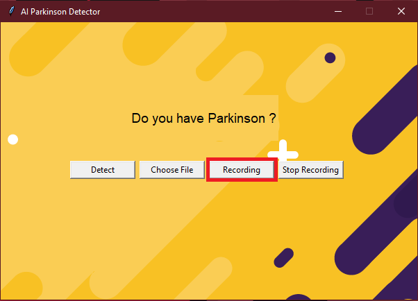

# Let's start

Watch the presentation video here :https://www.youtube.com/watch?v=K1oLz4x87Ug&feature=youtu.be

Take a look at our Medium article : https://medium.com/@alan.marthineau/diagnosing-parkinsons-disease-by-voice-using-linear-regression-in-python-73aad2712fba?sk=cb817fbc1479dbfde6095c98accd9c20

GitHub of the Parkinson detect lib : https://github.com/alan91620/ParkinsonRecoLib


## Getting Started
- Clone the repo and cd into the directory
```sh
git clone git@github.com:Milkad0/ParkinsonIA.git
cd ParkinsonIA
```
- Install jolib, pandas, numpy, sklearn and praat-parselmouth
```sh
pip install joblib
pip install pandas
pip install numpy
pip install sklearn
pip install praat-parselmouth
pip install pyaudio

```
- Run the app
```sh
python main.py
```
## How it works?

### Choose a file 

- Click on the "Choose File" button


- Select a .wav audio file


- Click on the "Detect" button


- Watch the result !


### Record your voice

- Click on the "Recording" button



- Turn on your microphone and read the displayed text


- Click on the "Stop Recording" button


- Click on the "Detect" button


- Watch the result !


## Collaborators

Alan MARTHINEAU - Vincent ETHEVE - Augustin LOLLIVIER
